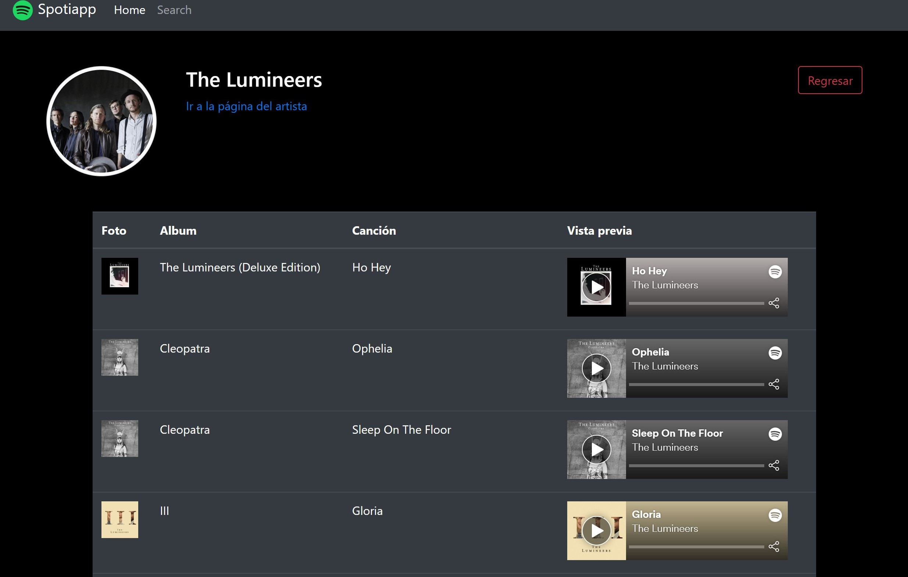

# SPOTIAPP

## OBJETIVE

It is a server-side application that accesses user related data through the Spotify Web API.

## DESIGN (screenshots)

### Home

### Search

### Top tracks

# Technologies

The main resources that have been utlizied in this project are:

- JAVASCRIPT
- TYPESCRIPT
- ANGULAR 4
- CSS FRAMEWORK: BOOTSTRAP

## Available Scripts

In the project directory server, you can run:

### `npm start`

In the project directory client, you can run:

Run `ng serve` for a dev server. Navigate to `http://localhost:4200/`. The app will automatically reload if you change any of the source files.
